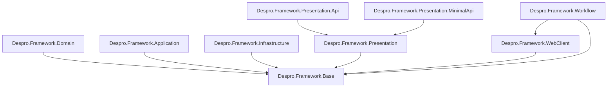

# Despro Framework

**Despro Framework** is a multi-layered enterprise framework built on **.NET 10.0** and
the principles of **Clean Architecture**. It packages cross-cutting infrastructure —
data access, CQRS, authentication, auditing, HTTP clients, workflow and licensing — into a
set of reusable, independently versioned **NuGet packages** so that product teams can
bootstrap an enterprise-grade Web API (controller-based or Minimal API) with a few
dependency-injection calls.

- **Target framework:** `net10.0`
- **Core package version (`Despro.Framework.Base`):** `2.0.8`
- **Distribution:** private NuGet feed (`MeganHub`)

---

## Features

- **Data access** — generic repository abstractions over **EF Core** (`IBaseRepository<>` /
  `Repository<>`, `IUnitOfWork`) and **Dapper** (`IDapperRepository<>`), exposed through a
  unified `IRepositoryServices` entry point.
- **CQRS** — command/query handling via **MediatR**, with a custom dispatcher
  (`ICustomPublisher` / `CustomPublisher`) and a validation pipeline behavior
  (`CommandValidationBehavior<,>`) backed by FluentValidation.
- **Authentication & authorization** — JWT bearer authentication and role-based access
  control through `IAuthService` / `AuthService`, resolving identity and roles from JWT
  claims.
- **Audit logging** — deferred bulk logging persisted to **MongoDB** (`ILogService` /
  `MongoLogService`, `ILoggingContext`), with no-op implementations when logging is
  disabled.
- **Typed HTTP client** — `Despro.Framework.WebClient` for typed outbound HTTP integration.
- **Workflow integration** — `Despro.Framework.Workflow` with workflow instance
  repositories (`IWorkflowInstanceRepository`).
- **Hardware-bound licensing** — `Despro.Framework.License` ties licenses to a hardware
  fingerprint (`HardwareFingerprint`, `SecurityCoreGuard`, `ApplicationUnlocker`), with a
  companion `Despro.Framework.LicenseGenerator`.

---

## Architecture

Despro follows a Clean Architecture layering where dependencies flow inward toward the
shared core abstractions:

```
Base → Domain → Application → Infrastructure → Presentation
```

`Base` holds the cross-cutting abstractions (CQRS interfaces, base models, validators)
that every other layer depends on. Concrete implementations live in `Infrastructure`,
while `Presentation` (and its `Api` / `MinimalApi` specializations) exposes the HTTP
surface.

### Projects

| Project | Version | Role |
| --- | --- | --- |
| `Despro.Framework.Base` | 2.0.8 | Core abstractions: CQRS interfaces, base models, validators, shared utilities. |
| `Despro.Framework.Domain` | 2.0.3 | Domain models and contracts built on `Base`. |
| `Despro.Framework.Application` | 2.0.4 | Application layer: MediatR pipeline behaviors and command/query tooling. |
| `Despro.Framework.Infrastructure` | 2.1.2 | Data persistence (EF Core, Dapper), security, MongoDB logging, DI wiring. |
| `Despro.Framework.Presentation` | 2.0.9 | JWT auth, CORS, Swagger, Mapster and API versioning setup. |
| `Despro.Framework.Presentation.Api` | 2.0.6 | Controller-based presentation specialization. |
| `Despro.Framework.Presentation.MinimalApi` | 2.0.8 | Minimal API endpoint registration and routing. |
| `Despro.Framework.WebClient` | 2.0.3 | Typed HTTP client integration. |

### Project relationships

The actual `ProjectReference` graph between the projects:



> `Despro.Framework.License` and `Despro.Framework.LicenseGenerator` are standalone and do
> not reference the other projects.

---

## Installation / NuGet

All packages are published to the private **`MeganHub`** feed defined in
[`NuGet.Config`](NuGet.Config):

```
https://hub.megan.ir/nuget/index.json
```

### Add the feed

Using the existing `NuGet.Config` at the repository root is enough. To register the feed
manually elsewhere:

```bash
dotnet nuget add source "https://hub.megan.ir/nuget/index.json" --name MeganHub
```

### Install packages

```bash
dotnet add package Despro.Framework.Base
dotnet add package Despro.Framework.Application
dotnet add package Despro.Framework.Infrastructure
dotnet add package Despro.Framework.Presentation

# Pick the presentation flavor your project uses:
dotnet add package Despro.Framework.Presentation.Api          # controller-based
dotnet add package Despro.Framework.Presentation.MinimalApi   # minimal API

# Optional add-ons:
dotnet add package Despro.Framework.Domain
dotnet add package Despro.Framework.WebClient
```

---

## Getting Started / DI Bootstrap

Register the framework services in `Program.cs` using the framework's extension methods.
The infrastructure registration needs the assemblies that contain your use cases
(commands) and queries so MediatR handlers and validators can be discovered.

```csharp
using System.Reflection;
using Despro.Framework.Application;
using Despro.Framework.Infrastructure;
using Despro.Framework.Presentation;
using Despro.Framework.Presentation.Api;          // or Despro.Framework.Presentation.MinimalApi

var builder = WebApplication.CreateBuilder(args);
var configuration = builder.Configuration;
var services = builder.Services;

// Assemblies that contain your MediatR use cases (commands) and queries.
var useCaseAssembly = Assembly.GetExecutingAssembly();
var queryAssembly = Assembly.GetExecutingAssembly();

// Infrastructure: repositories, auth, error logging, MediatR, MongoDB audit logging.
services.AddFrameworkInfrastructure(
    configuration,
    useCaseAssembly,
    queryAssembly,
    MongoDbLog: true); // set false to disable MongoDB logging (uses no-op log services)

// Application: MediatR validation pipeline behavior + FluentValidation validators.
services.AddFrameworkApplication();

// Presentation: JWT authentication, Swagger, Mapster, CORS, HSTS, memory cache.
services.AddFrameworkPresentationWeb(
    configuration,
    ApplicationName: "My Application",
    CorsPolicyName: "DefaultCorsPolicy");

// Controller-based presentation:
services.AddFrameworkPresentationWebApi(RoutePrefix: "v{version:apiVersion}/[controller]");

// --- OR --- Minimal API presentation (registers BaseEndpoint implementations):
// services.AddFrameworkPresentationWebMinimalApi(
//     ApiAssembly: Assembly.GetExecutingAssembly(),
//     RoutePrefix: "v{version:apiVersion}/[controller]");

// Optional: workflow integration.
services.AddFrameworkWorkflow();

var app = builder.Build();
app.Run();
```

### Extension method signatures

| Method | Source | Signature |
| --- | --- | --- |
| `AddFrameworkInfrastructure` | `Despro.Framework.Infrastructure/FrameworkInfrastructureDi.cs` | `(this IServiceCollection services, IConfiguration configuration, Assembly useCaseAssembly, Assembly queryAssembly, bool MongoDbLog = false)` |
| `AddFrameworkApplication` | `Despro.Framework.Application/FrameworkApplicationDi.cs` | `(this IServiceCollection services)` |
| `AddFrameworkPresentationWeb` | `Despro.Framework.Presentation/FrameworkPresentationWebDi.cs` | `(this IServiceCollection services, IConfiguration configuration, string ApplicationName, string CorsPolicyName)` |
| `AddFrameworkPresentationWebApi` | `Despro.Framework.Presentation.Api/FrameworkPresentationWebDi.cs` | `(this IServiceCollection services, string RoutePrefix)` |
| `AddFrameworkPresentationWebMinimalApi` | `Despro.Framework.Presentation.MinimalApi/FrameworkPresentationWebDi.cs` | `(this IServiceCollection services, Assembly ApiAssembly, string RoutePrefix)` |
| `AddFrameworkWorkflow` | `Despro.Framework.Workflow/FrameworkWorkflowDi.cs` | `(this IServiceCollection services)` |

---

## Configuration

The framework reads the following keys from `appsettings.json` (or any configured
`IConfiguration` source).

| Section / Key | Used by | Notes |
| --- | --- | --- |
| `MongoDbConfig:ConnectionString` | `AddFrameworkInfrastructure` (when `MongoDbLog: true`) | Required when MongoDB logging is enabled; throws if missing. |
| `MongoDbConfig:DatabaseName` | `AddFrameworkInfrastructure` (when `MongoDbLog: true`) | Database used for audit logs. |
| `JwtConfig:SignInKey` | `AddJwtAuthentication` (`Despro.Framework.Presentation/Utilites`) | Symmetric signing key (UTF-8). |
| `JwtConfig:Issuer` | `AddJwtAuthentication` | Validated token issuer. |
| `JwtConfig:Audience` | `AddJwtAuthentication` | Validated token audience. |
| `App:CorsOrigins` | `AddFrameworkPresentationWeb` | Comma-separated list of allowed origins. |

### Example `appsettings.json`

```json
{
  "MongoDbConfig": {
    "ConnectionString": "mongodb://localhost:27017",
    "DatabaseName": "DesproLogs"
  },
  "JwtConfig": {
    "SignInKey": "replace-with-a-long-random-secret-key",
    "Issuer": "https://your-app.example.com",
    "Audience": "https://your-app.example.com"
  },
  "App": {
    "CorsOrigins": "https://localhost:5173,https://app.example.com"
  }
}
```

> JWT validation enables issuer, audience, lifetime and signing-key checks with zero clock
> skew. A bearer token may also be supplied via an `access_token` query string parameter.

---

## Tech Stack / Dependencies

Versions are taken from the project files.

| Package | Version | Used in |
| --- | --- | --- |
| MediatR | 14.0.0 | Base, Application, Infrastructure |
| FluentValidation | 12.1.1 | Base, Infrastructure |
| FluentValidation.DependencyInjectionExtensions | 12.1.1 | Base, Infrastructure |
| Mapster | 7.4.0 | Base |
| Microsoft.EntityFrameworkCore | 10.0.2 | Base, Infrastructure |
| Microsoft.EntityFrameworkCore.SqlServer | 10.0.2 | Infrastructure |
| Dapper | 2.1.66 | Infrastructure |
| MongoDB.Driver | 3.6.0 | Infrastructure |
| Newtonsoft.Json | 13.0.4 | Base |
| Microsoft.AspNetCore.Mvc.NewtonsoftJson | 10.0.2 | Presentation |
| Microsoft.AspNetCore.Authentication.JwtBearer | 10.0.2 | Presentation |
| System.IdentityModel.Tokens.Jwt | 8.15.0 | Infrastructure, Presentation |
| Microsoft.AspNetCore.OpenApi | 10.0.2 | Presentation |
| Swashbuckle.AspNetCore (+ Swagger / SwaggerGen) | 10.1.0 | Presentation |
| Asp.Versioning.Http | 8.1.1 | Presentation |
| Asp.Versioning.Mvc.ApiExplorer | 8.1.1 | Presentation |
| Microsoft.Extensions.DependencyInjection.Abstractions | 10.0.2 | WebClient |
| System.Management | 10.0.5 | License, LicenseGenerator |
| Obfuscar | 2.2.50 | License |

---

## Project Structure

Solution: [`DesproFramework.sln`](DesproFramework.sln)

```
Despro.Framework.Base
Despro.Framework.Domain
Despro.Framework.Application
Despro.Framework.Infrastructure
Despro.Framework.Presentation
Despro.Framework.Presentation.Api
Despro.Framework.Presentation.MinimalApi
Despro.Framework.WebClient
```